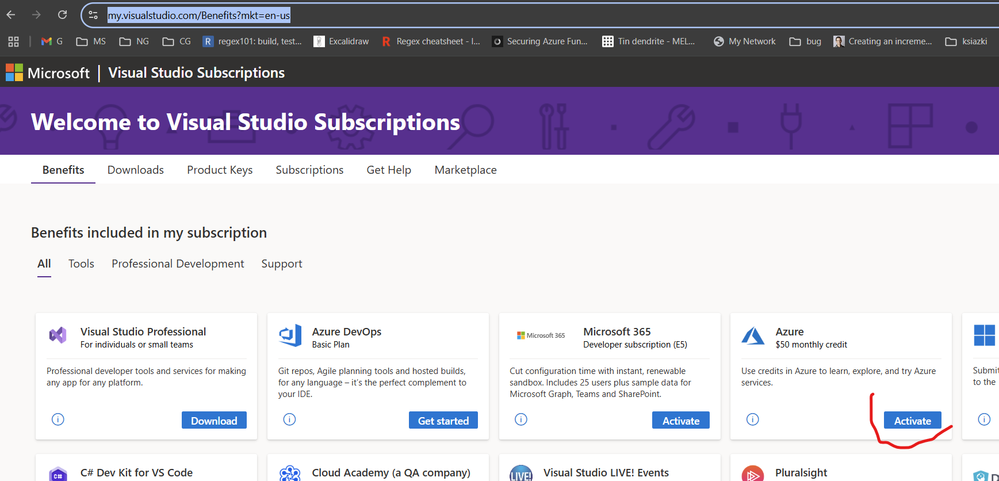
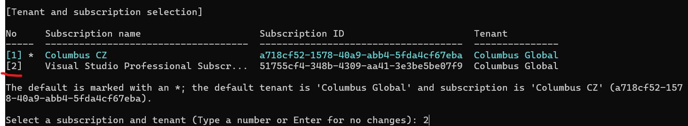

# BICEP Workshop

To go smoothly with our first Bicep workshop some pre-requisites have to be setup/executed.

## Enable Azure monthly credit
As Coloumbus employees we have 50$ to utilize on Azure Cloud for our purposes. Go to: https://my.visualstudio.com/Benefits?mkt=en-us, find `Azure 50$ monthly credit` and activate it:



## Required steps
### Run PowerShell console with elevated rights and execute:
``` PowerShell
Set-ExecutionPolicy Bypass -Scope Process -Force; [System.Net.ServicePointManager]::SecurityProtocol = [System.Net.ServicePointManager]::SecurityProtocol -bor 3072; iex ((New-Object System.Net.WebClient).DownloadString('https://community.chocolatey.org/install.ps1'))
```
### Execute below to get environment variables refreshed
``` PowerShell
refreshenv
```
### Execute below to get Azure CLI installed
``` PowerShell
choco install azure-cli
```
### Re-run PowerShell console also with elevated rights and execute
```
az login
```
### Followup instructions to get signed in properly
### Choose proper subscription when asked

## You're almost ready to go!
To be sure that everything is nice and dandy, try below script and see what happens:
``` PowerShell
az group create --name MyResourceGroup --location westeurope
```
When executed, go to [Azure portal](https://portal.azure.com/) and look for your resource group, make sure to switch there also to proper subscription, it should be Columbus Global.
## See you on workshop!
